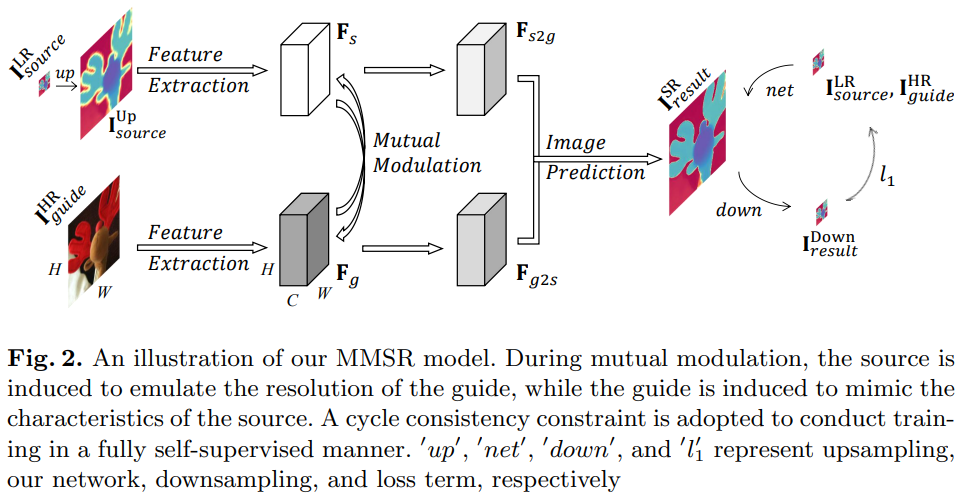
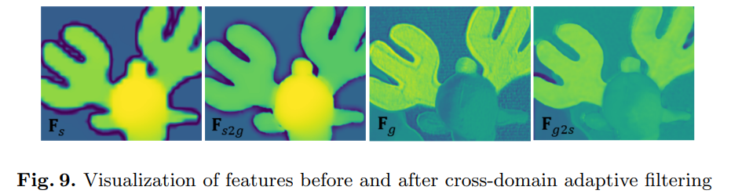
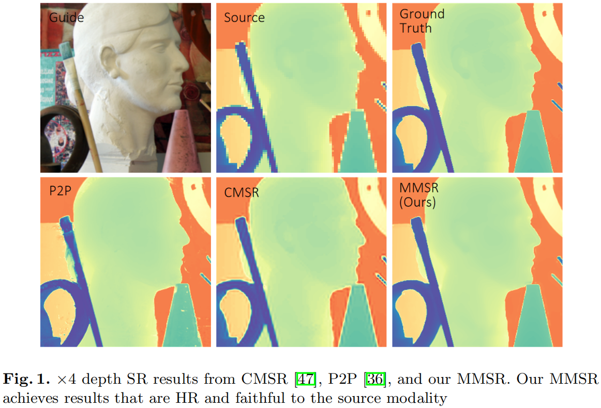
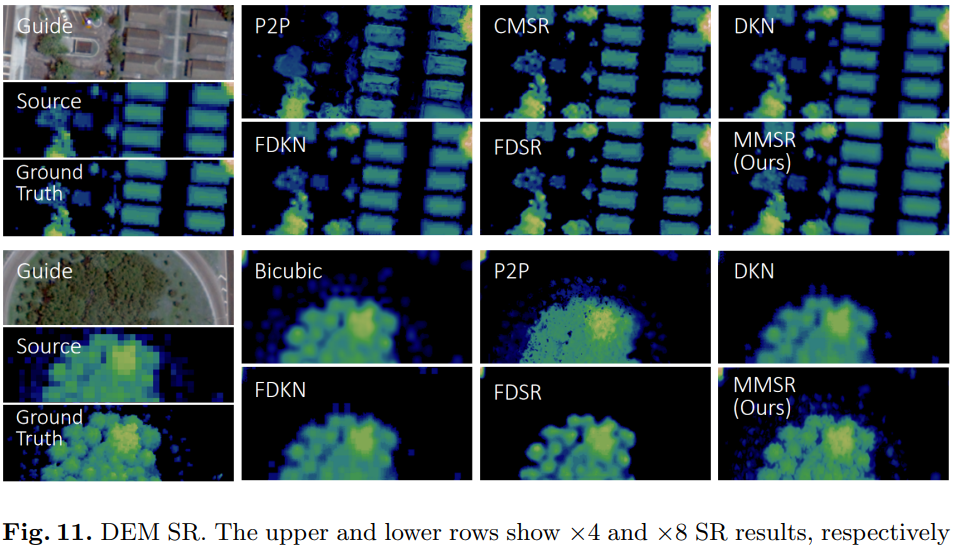
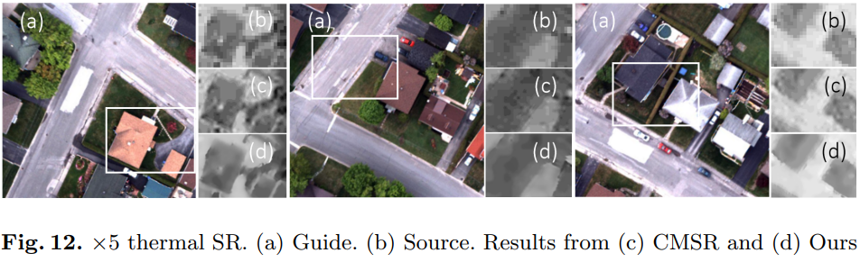

# MMSR
PyTorch implementation of "Learning Mutual Modulation for Self-Supervised Cross-Modal Super-Resolution"  
[[arXiv](https://arxiv.org/abs/2207.09156), [supp](https://static-content.springer.com/esm/chp%3A10.1007%2F978-3-031-19800-7_1/MediaObjects/539980_1_En_1_MOESM1_ESM.pdf)] [[ECCV paper](https://link.springer.com/chapter/10.1007/978-3-031-19800-7_1)]


## Updates
**[2022/07/04]** Our paper was accepted to ECCV 2022. See you in Tel-Aviv!  
**[2022/07/19]** Paper is available on [arXiv](https://arxiv.org/abs/2207.09156).  
**[2022/07/20]** Code has been uploaded. Our code was built on the [repository](https://github.com/prs-eth/PixTransform) of [P2P (ICCV2019)](https://arxiv.org/abs/1904.01501), we thank the authors for their efforts.   

## Overview

<p align="center">  </p>

<p align="center">  </p>

<p align="center">  </p>

<p align="center">  </p>

<p align="center">  </p>


## Quick Start
Please check [inference.ipynb](https://github.com/palmdong/MMSR/blob/main/inference.ipynb).  
For any question or discussion, reach Xiaoyu Dong at dong@ms.k.u-tokyo.ac.jp.


## Citation
```
@InProceedings{MMSR_2022_ECCV,
  author    = {Dong, Xiaoyu and Yokoya, Naoto and Wang, Longguang and Uezato, Tatsumi},
  title     = {Learning Mutual Modulation for Self-Supervised Cross-Modal Super-Resolution},
  booktitle = {ECCV},
  year      = {2022}
}
```
