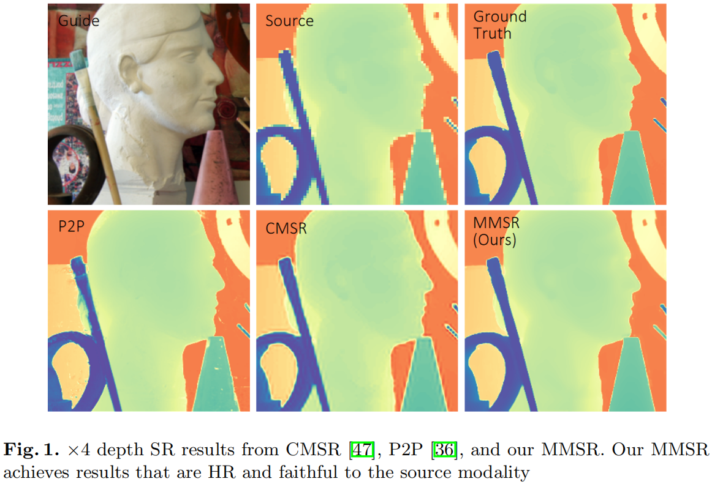

# MMSR
PyTorch implementation of "Learning Mutual Modulation for Self-Supervised Cross-Modal Super-Resolution"  
[ECCV2022 [paper](https://www.ecva.net/papers/eccv_2022/papers_ECCV/papers/136790001.pdf), [supp](https://www.ecva.net/papers/eccv_2022/papers_ECCV/papers/136790001-supp.pdf)] [[arXiv](https://arxiv.org/abs/2207.09156)]

<p align="center">  </p>


## Updates
**[2022/07/04]** We thank anonymous reviewers from ECCV2022 and CVPR2022 for their suggestions to our paper. See you in Tel-Aviv!  
**[2022/07/19]** Paper is available on [arXiv](https://arxiv.org/abs/2207.09156).  
**[2022/07/20]** Code was uploaded. Our code was built on the [repository](https://github.com/prs-eth/PixTransform) of [P2P (ICCV2019)](https://arxiv.org/abs/1904.01501), we thank the authors for their efforts.   


## Quick Start
Check the Jupyter Notebook file [inference.ipynb](https://github.com/palmdong/MMSR/blob/main/inference.ipynb).  
For any question or discussion, reach Xiaoyu Dong at dong@ms.k.u-tokyo.ac.jp.


## Citation
```
@InProceedings{Dong2022MMSR,
  author    = {Dong, Xiaoyu and Yokoya, Naoto and Wang, Longguang and Uezato, Tatsumi},
  title     = {Learning Mutual Modulation for Self-Supervised Cross-Modal Super-Resolution},
  booktitle = {ECCV},
  year      = {2022}
}
```
